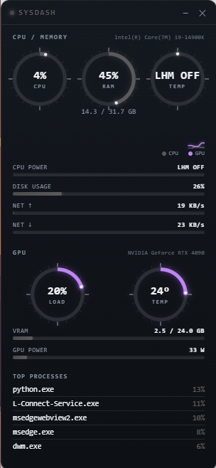

# SysDash (WebView edition)

Same lightweight floating dashboard as before, but the UI is now real
HTML/CSS/SVG rendered through **WebView2** (Windows' built-in Edge Chromium
engine) via `pywebview` — not Electron, not a bundled browser. You get
anti-aliased gauges, glow effects, and smooth animated transitions, while
staying far lighter than NZXT CAM or L-Connect.



## 1. Install dependencies

```
pip install -r requirements.txt
```

WebView2 Runtime is required — it's pre-installed on Windows 10 (21H2+) and
Windows 11. If you're on an older build, grab it here (one-time install,
~2 minutes): https://developer.microsoft.com/microsoft-edge/webview2/

## 2. GPU stats (NVIDIA)

GPU usage, temp, VRAM, and power draw are read directly from your driver via
NVML (`nvidia-ml-py`, installed by requirements.txt) — no LibreHardwareMonitor
or extra background app needed for this part. If NVML can't find a GPU
(driver issue, non-NVIDIA card, etc.), the GPU section shows "not detected"
and N/A values instead of crashing.

## 3. (Recommended) LibreHardwareMonitor for CPU temp/power

CPU package temp and power specifically need this — Windows doesn't expose
RAPL/thermal data to user-space apps without a sensor library, and NVML only
covers the GPU. Everything else (CPU/RAM%, disk, network, GPU, processes)
works without it.

1. https://github.com/LibreHardwareMonitor/LibreHardwareMonitor/releases
2. Run it (admin rights needed once, to load sensor drivers)
3. Options > Remote Web Server > Run (default port 8085, matches `LHM_URL`)

If it's not running, the CPU temp gauge and power bar show **"LHM OFF"**
specifically (rather than a generic N/A), so it's clear that's the fix
needed rather than a bug.

## 4. Run it

```
python main.py
```

- Drag from the titlebar (the `● SYSDASH` strip at top) to move the panel
- **—** minimizes to the system tray (right-click the tray icon for Show/Quit)
- **✕** closes the app fully

## 5. Run on startup (optional)

`Win+R` → `shell:startup` → drop a shortcut to `main.py` there. Set the
shortcut target to `pythonw.exe "C:\path\to\sysdash_web\main.py"` so no
console window appears.

## What's new since the first version

- **GPU card**: usage, temp, VRAM used/total, power draw for your NVIDIA GPU
  via NVML — separate section with its own color so it reads apart from CPU
- **Live history graph**: rolling ~60s strip showing CPU and GPU usage over
  time, CAM/L-Connect style
- **Threshold coloring**: gauges/bars shift from your accent color to amber
  (~80% usage / 80°C) to red (~95% usage / 90°C) automatically — tune the
  cutoffs in `web/app.js` under `THRESHOLDS` if you want different limits
- **"System Idle Process" filtered out of Top Processes** — psutil reports
  wildly wrong (often 1000%+) CPU values for it on Windows due to how it
  sums idle time across cores; it's not a real workload so it's dropped
  rather than shown as noise
- **LHM connection status is now explicit** — "LHM OFF" vs a bare "N/A" so
  it's clear when the fix is "go start LibreHardwareMonitor"

## Project layout

```
sysdash_web/
  main.py           <- backend: psutil polling, LHM fetch, tray, accent color, API bridge
  requirements.txt
  web/
    index.html      <- panel structure
    style.css        <- visuals: glow, gradients, rounded corners, transitions
    app.js          <- polls the backend every 1s, updates gauges/bars/process list
```

## Tuning the look

Everything visual lives in `web/style.css`:

- `--accent` is set at runtime from your Windows accent color, but you can
  hardcode it here for testing (e.g. `--accent: #ff6b6b;`)
- `.panel` controls the glow intensity (`box-shadow`) and corner radius
- `.gauge circle.value` controls the gauge stroke width/animation speed
- `.bar-fill` controls the bar gradient and glow

Behavior/data lives in `main.py` (`POLL_INTERVAL_S`, LHM URL, power-bar
scaling `/ 125` tuned loosely for a 14900K) and `web/app.js` (which mirrors
those same constants on the frontend for the gauge/bar math).

## Fallback

If WebView2 isn't available on a given machine for any reason, the original
Tkinter-based version (no web engine dependency at all) still works as a
plainer-looking fallback — just less polished visually.
